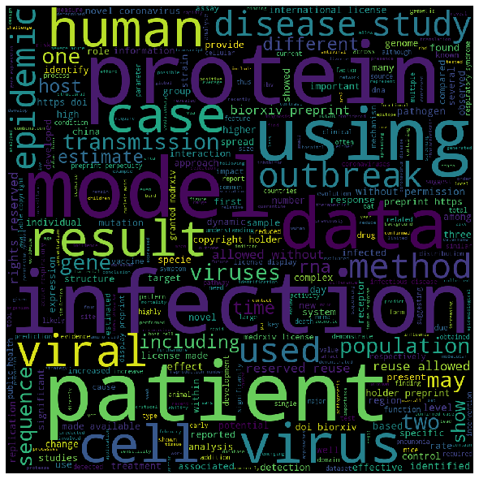

# README

- This repo is my humble effort in trying to identify any possible cause and possibly help any researcher working on Covid19.
- I do not hope to discover something extraordinary but I hope this repository can be of a small help to anyone working on it.
- This page will have all my main insights and the other notebooks in this repository will be my playground.
> Since most people seem to be focusing on the numerical data I will put my efforts on analysis of papers
# INSIGHTS FROM PAPERS

## Interaction with the data using text generation model
- Example Interaction:
- 
- [ ] TODO : Make a backend

## Most frequent terms
- Word Cloud from titles
- 
- Word Cloud from abstracts
- 
